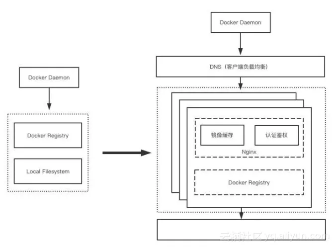

# Clawdbot 代理配置脚本

本仓库提供 `clawdbot-proxy-setup.ps1`，用于为 Clawdbot 配置 `openai-codex` 提供商的代理访问参数，并设置默认模型与思考等级。

## Clawdbot 安装与初始化

> 提示：官方仓库 README 使用 `openclaw` CLI。若你的环境仍是 `clawdbot` CLI，请将下方命令中的 `openclaw` 替换为 `clawdbot`。

1. 安装 Node.js（要求版本 >= 22）。
   - Windows 建议在 WSL2 环境使用。
2. 全局安装 CLI（任选其一）：
   - `npm install -g openclaw@latest`
   - `pnpm add -g openclaw@latest`
   - `bun add -g openclaw@latest`
3. 初始化配置（生成配置文件）：
   - `openclaw onboard --install-daemon`（推荐，含守护进程）
   - 或 `openclaw onboard`

本脚本依赖的配置文件位置解析顺序为：
- `CLAWDBOT_CONFIG_PATH`
- `CLAWDBOT_STATE_DIR/clawdbot.json`
- `~/.clawdbot/clawdbot.json`

## 脚本做了什么

- 读取 Clawdbot 配置文件。
- 交互式设置：
  - `Base URL`（你的代理网关地址）
  - 模型 ID（如 `gpt-5.2-codex`）
  - 模型别名
  - 默认 thinking 等级（off/minimal/low/medium/high/xhigh）
  - 是否更新 API key
- 更新配置中的 provider 与默认模型：
  - `models.providers.openai-codex.baseUrl`
  - `models.providers.openai-codex.api = "openai-responses"`
  - `models.providers.openai-codex.auth = "api-key"`
  - `models.providers.openai-codex.models = [{ id, name, input: ["text"] }]`
  - `agents.defaults.model.primary = "openai-codex/<modelId>"`
  - `agents.defaults.models["openai-codex/<modelId>"].alias`
  - `agents.defaults.thinkingDefault`
- 备份原配置为 `clawdbot.json.bak.<timestamp>`。
- 可选补丁：修改 `@mariozechner/pi-ai/dist/providers/transform-messages.js`，避免 `openai-responses` 下 `rs_` replay 触发 404。

## 使用方法

1. 确保已完成 Clawdbot 初始化（上文 `onboard`/`setup`）。
2. 运行脚本（PowerShell）：
   - `./clawdbot-proxy-setup.ps1`
3. 按提示填写 Base URL、模型 ID、别名、thinking 等级、API key。
4. 如需兼容 `openai-responses` 的 replay，可在提示时选择应用补丁。
5. 重启 Clawdbot（示例：`pm2 restart "clawdbot"`）。

## 注意事项

- 脚本会把 API key 写入配置文件（明文），请确保文件权限安全。
- Base URL 会自动去掉末尾 `/`，确保最终请求路径为 `<baseUrl>/...`。
- 若找不到配置文件，请先执行 `onboard` 或 `setup`。

## 参考文章要点（含图）

文章《知乎十万级容器规模的分布式镜像仓库实践》主要讨论了容器镜像仓库在大规模生产环境中的问题与解法，涵盖：
- 背景：容器化后镜像仓库成为关键基础设施。
- 典型问题：性能瓶颈、容量瓶颈、权限控制不足。
- 解决思路：将 Registry 改造为分布式服务，使用共享存储；客户端侧基于 DNS 的负载均衡并配合健康检查；引入 Nginx 做权限控制与缓存；自研 HDFS 存储驱动以满足私有云场景。

图 1：分布式镜像仓库实践示意图（来源：知乎专栏/阿里云开发者社区镜像）

图 2：架构方案示意图（来源：知乎专栏/阿里云开发者社区镜像）

原文链接：
- https://zhuanlan.zhihu.com/p/2000185166933557510
- https://developer.aliyun.com/article/606246
